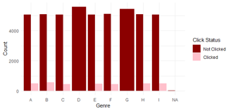

# Click Through Rate Analysis for BookSend.com

# Introduction

In the current era of digital communication, email marketing campaigns are essential for keeping audiences engaged and driving business growth. To achieve this, it's crucial to understand the click-through rates (CTRs) of these campaigns, which help optimize future emails and inform advertising rates.  

This report focuses on modeling the CTR for Booksend.com using historic data for 50,000 emails, performing exploratory data analysis (EDA), identifying important features and trends, and evaluating using efficient predictive models to optimize performance and proffer recommendations for the business.

# Data Description 

## Understanding the Dataset
Dataset Source: Case2_final_adTech_data.csv
Data types: Char, Num, Int
Observation:50,000
Variable: 12

### Data Variables Explained
**Email_ID**: Unique identifier for each email.

**Subject_Marketability_score:** Expected attractiveness of the email subject, indicating potential click-through rate (CTR).

**Customer_Location**: State of the recipient identified through IP address.

**Total_Past_Communications:** Total number of past emails received by the recipient.

**Word_Count**: Length of email text, carefully designed to attract clicks without overwhelming readers.

**Total_Links:** Number of offers or links in the email.

**Total_Images:** Number of images used in the email.

**Signup_Site:** Category or email list to which the recipient is subscribed.

**Genre:** Main genre of the email offering, encoded with factors.

**Sent_Hour:** Timestamp indicating the hour when the email was sent.

**Browser**: Browser used by the recipient to open the email.

**Y_click:** Dependent variable indicating whether the email was opened and clicked (1) or not clicked (0).

## Partitioning Utilized a 70-30 split
70% of the data used for model training and 30% kept aside for evaluation.

## Modeling Techniques
**Decision Tree**

**Random Forest**

## Exploratory Data Analysis

An Overview of the dataset

**0 – Not clicked**

**1 - Clicked**

## Click and not click distribution

## Click through rate per browser

## Relationship between Genre and Click-through rate

**Observation:** 

Irrespective of the genre, the non click rates are uniform across all genre

## Click through rate and relationship with images 

**Observation:** 

There is 50% chances of clicks with more images

